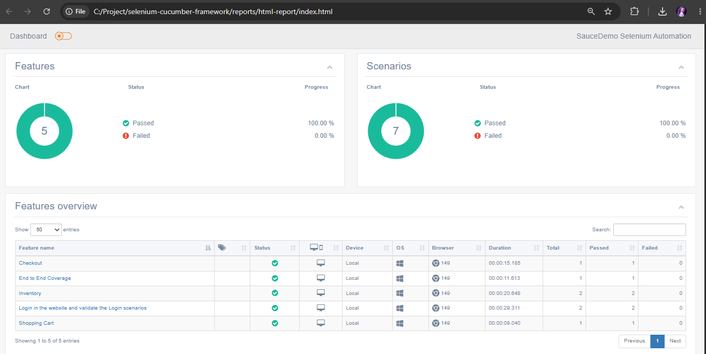

# Selenium Cucumber JavaScript Automation Framework

A robust Selenium WebDriver automation framework built using **JavaScript**, **Node.js**, and **Cucumber BDD** to automate end-to-end testing of the SauceDemo e-commerce application.

The framework follows the **Page Object Model (POM)** design pattern with reusable utilities, Cucumber Hooks, screenshot capture, and HTML reporting to ensure maintainability, scalability, and easy execution.

---

## Features

* Selenium WebDriver with JavaScript
* Cucumber BDD (Gherkin)
* Page Object Model (POM)
* Explicit Waits
* Reusable Page Objects
* Before & After Hooks
* Screenshot Capture on Test Failure
* HTML Test Reporting
* End-to-End Test Scenarios
* Modular & Scalable Framework
* Git Version Control

---

## Tech Stack

* JavaScript (ES6)
* Node.js
* Selenium WebDriver
* Cucumber BDD
* Multiple Cucumber HTML Reporter
* Git
* GitHub
* WebStorm

---

## Application Under Test

**SauceDemo**

https://www.saucedemo.com

---

## Project Structure

```text
selenium-cucumber-js-framework
│
├── features
│   ├── login.feature
│   ├── inventory.feature
│   ├── cart.feature
│   └── checkout.feature
│
├── step-definitions
│   ├── login_steps.js
│   ├── inventory_steps.js
│   ├── cart_steps.js
│   └── checkout_steps.js
│
├── pages
│   ├── login_page.js
│   ├── inventory_page.js
│   ├── cart_page.js
│   └── checkout_page.js
│
├── support
│   └── hooks.js
│
├── utils
│   ├── driver_factory.js
│   └── screenshotUtil.js
│
├── screenshots
│   └── html-dashboard-report.png
│
├── reports
│   ├── cucumber-report
│   ├── html-report
│   └── screenshots
│
├── package.json
├── report.js
└── README.md
```

---

## Automated Test Coverage

### Login Module

* Valid Login
* Invalid Username
* Invalid Password
* Locked Out User Login
* Empty Credentials Validation

### Inventory Module

* Verify Product Listing
* Verify Product Details
* Verify Product Sorting
* Verify Product Count
* Add Product to Cart
* Verify Cart Badge Count

### Cart Module

* Verify Added Products
* Remove Product from Cart
* Continue Shopping
* Proceed to Checkout

### Checkout Module

* Validate Customer Information
* Verify Checkout Overview
* Verify Item Total
* Verify Tax
* Verify Grand Total
* Complete Order Successfully

### End-to-End Scenario

* Login
* Add Product to Cart
* Verify Cart
* Checkout
* Complete Purchase
* Verify Order Confirmation

---

## Installation

```bash
git clone https://github.com/Parag81/selenium-cucumber-js-framework.git

cd selenium-cucumber-js-framework

npm install
```

## HTML Report



---

## Execute Tests

Run all feature files:

```bash
npm test
```

Run a specific feature:

```bash
npx cucumber-js features/login.feature
```

Run and generate report:

```bash
npm run test-report
```

---

## Test Reports

The framework automatically generates:

* Cucumber JSON Report
* HTML Report
* Failure Screenshots

Reports are available under:

```text
reports/
```

---

## Framework Design

The framework follows the **Page Object Model (POM)** to improve:

* Maintainability
* Reusability
* Readability
* Scalability

---

## Framework Components

### Feature Files

BDD scenarios written using Gherkin syntax.

### Step Definitions

Maps Gherkin steps to Selenium automation code.

### Page Objects

Contains web element locators and reusable business methods.

### Hooks

Framework setup and teardown.

* Browser Initialization
* Browser Cleanup
* Screenshot Capture on Failure

### Utilities

Reusable helper classes.

* Driver Factory
* Screenshot Utility

---

## Future Enhancements

* Cross Browser Execution (Chrome, Edge, Firefox)
* Data Driven Testing
* GitHub Actions CI/CD Pipeline
* Environment Configuration (.env)
* Logging Framework
* Parallel Test Execution

---

## Author

**Parag Khare**

**LinkedIn**

https://linkedin.com/in/parag-khare-573ab0206

**GitHub**

https://github.com/Parag81
